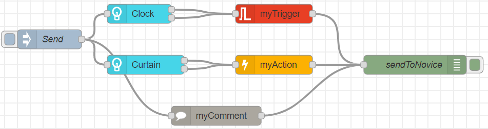

# Documentation
In this readme, you find the information needed to implement features requested by novices.

This is an example of a feature for rolling up curtains

## Useful nodes
These nodes are needed to send the implementation to the novice.

### inject
This node allows you to manually run the implementation using the button.

**IMPORTANT: You must always press _deploy_ in the top right corner before pressing the inject button**

<!-- ### http request
This node allows you to send the implementation to the novice using http.

### debug
Allows you to print the JSON object of devices, triggers, actions or exports. -->

## Devices
Devices that the user owns.

### Philips Hue Bulb
A Philips Hue lightbulb.

Details

#### Input: 
Name | Type | Description|Required
--- | --- | --- |---|
inject|node inputs|Activates the node|Required
#### Outputs:

Name | Type | Description
--- | --- | --- |
deviceId|int|The id of the device
lightState|bool|Turn the light on or off
brightness|int|The brightness value to set the light to.Brightness is a scale from 1 (the minimum the light is capable of) to 254 (the maximum).
hue|uint16|The hue value to set light to. The hue value is a wrapping value between 0 and 65535. Both 0 and 65535 are red, 25500 is green and 46920 is blue.

### Philips Hue Motion Sensor
A motion sensor for detecting presence.

Details

#### Input: 
Name | Type | Description|Required
--- | --- | --- |---|
inject|node inputs|Activates the node|Required
#### Outputs:
Name | Type | Description
--- | --- | --- |
deviceId|int|The id of the device
presence|bool|Whether the sensor detects motion.

## Controls

### myTrigger
Defines a trigger, for specifying which condition that triggers an action.

Details

#### Input:
Name | Type | Description|Required
--- | --- | --- |---|
deviceFields|node inputs|Triggers need both an id of the device to read values from, and the specific field of the device to be read. These can be wired from device nodes|Required

#### Outputs:
Name | Type | Description
--- | --- | --- |
trigger|json|A json object of the trigger. Triggers can be input to the myExport component.

#### Fields:
Fields can be accessed by double-clicking nodes.

Field | Type | Description |Required
--- | --- | --- |---|
Name|string|Sets the name of the trigger in the Node-Red editor|Optional
Operator|operator|Sets the operator of the trigger. Can be: <,> or ==|Required
Value|A primitive, based on the input field|sets the value that the input device field should be to pass the condition |Required

### triggerCustomization
Defines a customization for a trigger. The triggerCustomizations can be used to provide extra trigger options for the novice to select from. The option to provide can be selected in the fields.

Details

#### Input:
Name | Type | Description|Required
--- | --- | --- |---|
trigger|node inputs|The trigger that can be customized further with the triggerCustomization.|Required

#### Outputs:
Name | Type | Description
--- | --- | --- |
customized trigger|json|A json object of the customized trigger. Triggers can be input to the myExport component.

#### Fields:
Fields can be accessed by double-clicking nodes.

Field | Type | Description |Required
--- | --- | --- |---|
Name|string|Sets the name of the customization in the Node-Red editor|Optional
Customization|Customization|The type of customization to allow for the novice.|Required

### myAction
Defines an action, for specifying what should happen when a trigger condition is satisfied.

Details

#### Input:
Name | Type | Description|Required
--- | --- | --- |---|
deviceFields|node inputs|Actions need both an id of the device to set values on, and the specific field of the device to be set. These can be wired from device nodes|Required

#### Outputs:
Name | Type | Description
--- | --- | --- |
action|json|A json object of the action. Actions can be input to the myExport component.

#### Fields:
Fields can be accessed by double-clicking nodes.

Field | Type | Description |Required
--- | --- | --- |---|
Name|string|Sets the name of the action in the Node-Red editor|Optional
Value|A primitive, based on the input field|The value to set the input device value to.|Required

### actionCustomization
Defines a customization for an action. The triggerCustomizations can be used to provide extra action options for the novice to select from. The option to provide can be selected in the fields.

Details

#### Input:
Name | Type | Description|Required
--- | --- | --- |---|
action|node inputs|The action that can be customized further with an actionCustomization.|Required

#### Outputs:
Name | Type | Description
--- | --- | --- |
customized action|json|A json object of the customized action. Actions can be input to the myExport component.

#### Fields:
Fields can be accessed by double-clicking nodes.

Field | Type | Description |Required
--- | --- | --- |---|
Name|string|Sets the name of the customization in the Node-Red editor|Optional
Customization|Customization|The type of customization to allow for the novice.|Required

### myComment
Comments, that can help explain your implementation to technological novices.

Details

#### Input:
Name | Type | Description|Required
--- | --- | --- |---|
inject|node inputs|Activates the node|Required

#### Outputs:
Name | Type | Description
--- | --- | --- |
comment|json|A json object of the comment. Comments can be input to the myExport component.

#### Fields:
Fields can be accessed by double-clicking nodes.

Field | Type | Description |Required
--- | --- | --- |---|
Comment Name|string|Sets the name of the action in the Node-Red editor. Also used as the title for the comment when exported.|Optional
Comment Text|string|Your description of your feature, such that the novice can understand your feature|Required

<!-- ### myExport
Gathers triggers, actions and comments to an object, which can be exported using http.

Details

#### Input:
Name | Type | Description|Required
--- | --- | --- |---|
actionCommentTrigger|node inputs|Exports need actions and triggers, in order to define a feature to be exported. These can be wired from trigger, action and comment nodes.|An action and a trigger is required, comments are optional.

#### Outputs:
Name | Type | Description
--- | --- | --- |
feature|json|A json object of a feature. Features can be input to the http component, in order to send the feature to the novice.

#### Fields:
Fields can be accessed by double-clicking nodes.

Field | Type | Description |Required
--- | --- | --- |---|
Name|string|Sets the name of the export in the Node-Red editor|Optional

 -->

